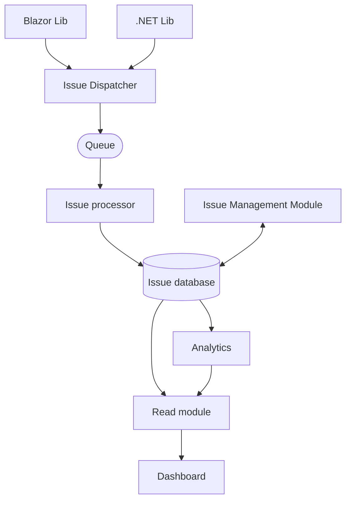

# Issue Tracker modules

Here is a high level overview of Issue Tracker architecture.

```mermaid
flowchart TB
    blazorLib[Blazor Lib]
    dotnetLib[.NET Lib]
    issueDispatcher[Issue Dispatcher]
    issueProcessor[Issue processor]
    readModule[Read module]
    issueManagementModule[Issue Management Module]
    analytics[Analytics]
    dashboard[Dashboard]
    incommingQueue([Queue])
    issueDatabase[(Issue database)]

    
    blazorLib & dotnetLib --> issueDispatcher --> incommingQueue --> issueProcessor --> issueDatabase
    issueManagementModule <--> issueDatabase --> readModule & analytics
    analytics --> readModule
    readModule --> dashboard
```
